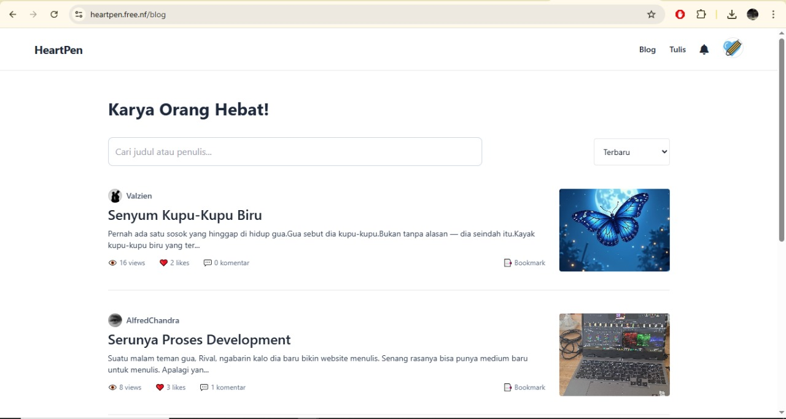

# ❤️ HeartPen


HeartPen adalah **website blog modern** untuk berbagi tulisan, cerita, dan ide kreatif.  
Website ini sudah **launching publik** dan bersifat open source untuk tujuan edukasi & pengembangan.

---

## 📑 Table of Contents
- [✨ Features](#-features)
- [🚀 Installation](#-installation)
- [📸 Screenshots](#-screenshots)
- [🙌 Contributing](#-contributing)
- [⚠️ Disclaimer](#-disclaimer)
- [📜 License](#-license)

---

## ✨ Features
✅ Desain simple & responsif  
✅ Sistem posting blog yang mudah digunakan  
✅ Struktur kode PHP yang bersih & mudah dikembangkan  
✅ Cocok untuk belajar membuat website blog dari awal  

---

## 🚀 Installation

1. Clone repository ini:
```bash
git clone https://github.com/Valzien/HeartPen.git
```
Pindahkan ke server lokal (XAMPP / Laragon / dsb).

Taruh folder di dalam htdocs (untuk XAMPP).

Buka di browser:

http://localhost/HeartPen

## 📸 Screenshots

| Homepage | Post Detail |
|----------|-------------|
|  |  |


## 🙌 Contributing
Kontribusi sangat terbuka!
Silakan fork repository ini, kembangkan fitur baru, atau perbaiki bug, lalu ajukan pull request.

## ⚠️ Disclaimer
HeartPen dibuat untuk tujuan edukasi dan pengembangan.
Pemilik repository tidak bertanggung jawab atas penyalahgunaan kode ini.

📜 License
This project is licensed under the Apache License 2.0 – lihat file LICENSE untuk detail.

© 2025 Valzien
